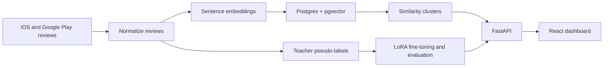

# Feedback Lens

An end-to-end local ML system for turning mobile-app reviews into prioritized
product insights.

## What it does

- Collects iOS App Store and Google Play reviews, then normalizes them into one schema.
- Uses a teacher model to pseudo-label review category and severity.
- Fine-tunes Qwen2.5-1.5B-Instruct with LoRA for local review classification.
- Evaluates base Qwen, the LoRA adapter, and the teacher against a human-labeled gold set.
- Embeds reviews with Sentence Transformers, clusters repeated feedback with pgvector, and ranks clusters by frequency and severity.
- Serves the insights through FastAPI and a React dashboard with live local classification.

## Architecture



## Current demo snapshot

- 2,399 normalized mobile-app reviews
- 73 similarity clusters at cosine similarity >= 0.85
- 100 manually labeled gold-set reviews
- Category accuracy on the gold set: base Qwen **44%**, LoRA-tuned Qwen **72%**, teacher model **73%**

The dashboard displays current database counts; the evaluation metrics above are
the recorded 100-review comparison run.

## Run locally with Docker

With Docker Desktop running, start PostgreSQL (with pgvector), the FastAPI API,
and the React demo together:

```powershell
docker compose up --build
```

Open the demo at http://localhost:5173. The API is available at
http://localhost:8000 and its interactive documentation is at
http://localhost:8000/docs.

The API container connects to the Compose Postgres service automatically. The
live `/classify` demo uses the local LoRA adapter mounted from
`finetuning/checkpoints/`; run the fine-tuning step first if that directory is
empty. The base model downloads on its first classification request and is
cached in the named `hf-cache` Docker volume.

### GPU-backed live classification

The default Compose setup uses the RTX 5070 Ti through CUDA-enabled PyTorch.
Verify GPU access after the stack starts:

```powershell
docker compose exec backend python -c "import torch; print(torch.cuda.is_available()); print(torch.cuda.get_device_name(0))"
```

It should print `True` and `NVIDIA GeForce RTX 5070 Ti`. The first request still
downloads and loads the base model; later requests use the loaded GPU model.

Stop the stack with:

```powershell
docker compose down
```

## Verify a local run

With the stack running, check the API and dashboard data routes:

```powershell
python backend/scripts/smoke_test.py
```

Run the local automated checks:

```powershell
python -m unittest discover -s tests -v
cd frontend
npm run build
```

GitHub Actions runs the same backend tests with a temporary pgvector Postgres
service and verifies the frontend production build on each push and pull request.

## Run the local pipeline

The orchestrator runs the safe local rebuild path (normalize, embed, cluster)
and writes an ignored JSON run report under `data/processed/pipeline_runs/`:

```powershell
python pipeline/run_pipeline.py
```

Preview any command before it changes data, calls a paid API, or scrapes:

```powershell
python pipeline/run_pipeline.py --google-packages com.discord --scrape-limit 20 --dry-run
```

The orchestrator refuses to run more than 20 scraped reviews per app or more
than 20 paid labels without an explicit confirmation flag. Full teacher labeling
also requires using `labeling/teacher_labeler.py --estimate-only` first.

## Known limitations

- This is a local portfolio demo, not a deployed multi-user service.
- Most training labels are teacher-generated; the gold set is currently 100 human-labeled reviews.
- The dashboard's cluster label is inherited from its representative review.
- Scrapers and the local model depend on the availability and terms of their external providers.
