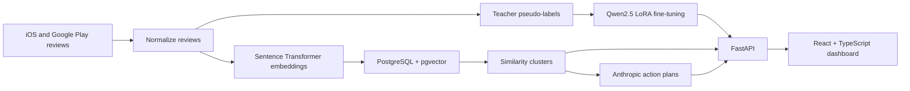
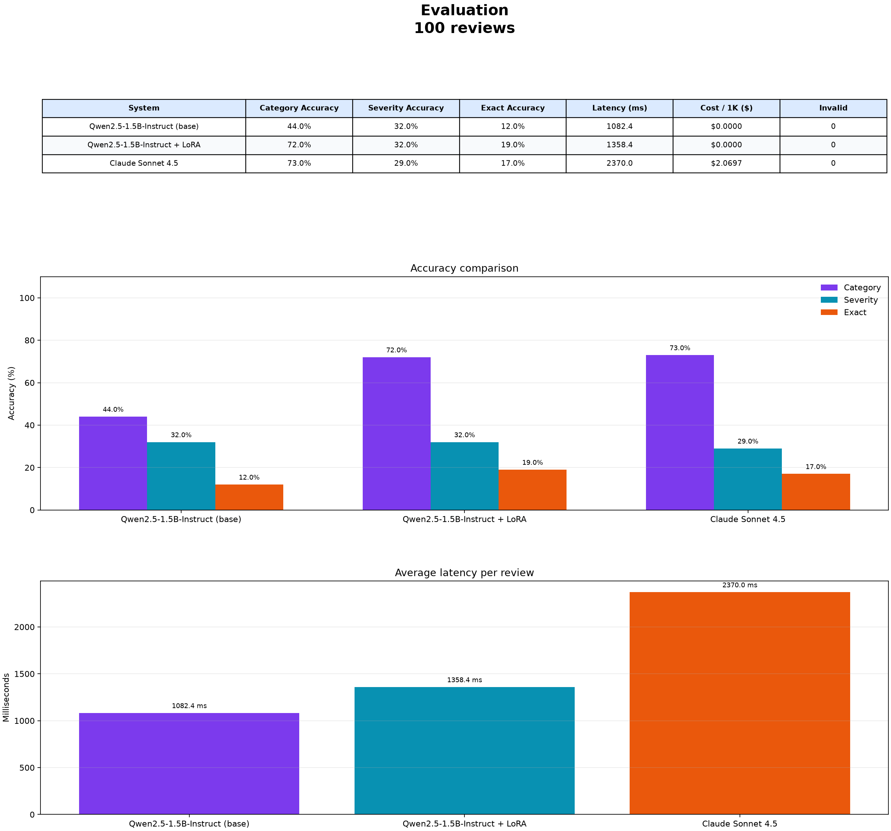

# Feedback Lens

Feedback Lens is an end-to-end machine learning system that turns iOS App Store and Google Play reviews into prioritized product insights. The project is deployed on AWS and also includes a local Docker workflow for running the full stack with GPU-backed inference.

## What it does

- Collects iOS App Store and Google Play reviews and normalizes them into one schema.
- Uses a teacher model to pseudo-label review category and severity.
- Fine-tunes Qwen2.5-1.5B-Instruct with LoRA and PyTorch for review classification.
- Evaluates the base Qwen model, LoRA adapter, and teacher against a manually labeled gold set.
- Embeds reviews with Sentence Transformers and clusters recurring feedback with PostgreSQL and pgvector.
- Ranks recurring issues using frequency and severity.
- Serves results through FastAPI and a React + TypeScript dashboard with live GPU-backed classification.
- Generates optional evidence-backed product action plans with the Anthropic API.

## Architecture



## Results

- **2,400** normalized mobile-app reviews
- **73** similarity clusters at cosine similarity >= 0.85
- **100** manually labeled gold-set reviews
- Base Qwen category accuracy: **44%**
- LoRA-tuned Qwen category accuracy: **72%**
- Teacher-model category accuracy: **73%**
- The LoRA adapter improved classification accuracy by approximately **63% relative to the base model** on the manually labeled evaluation set.



## Dashboard workflow

From the dashboard, users can search for an app, import reviews, classify them with the fine-tuned model, inspect recurring feedback clusters, and generate prioritized action plans. Imported reviews are embedded, stored in PostgreSQL, and included in a refreshed clustering run.

The optional Anthropic action-plan workflow sends a compact summary of matching clusters and asks Claude to produce concrete recommendations grounded in the detected feedback.

## Deployment

Feedback Lens is deployed on **AWS**. The repository also preserves a local Docker workflow so the ML pipeline, database, API, frontend, and GPU inference path can be reproduced independently.

## Run locally with Docker

> **Hardware requirement:** Live local classification requires an NVIDIA CUDA-capable GPU. The local configuration is tested on an RTX 5070 Ti.

With Docker Desktop running, start PostgreSQL with pgvector, the FastAPI backend, and the React frontend:

```powershell
docker compose up --build
```

Open the dashboard at `http://localhost:5173`. The API is available at `http://localhost:8000`, with interactive documentation at `http://localhost:8000/docs`.

The live `/classify` endpoint uses the LoRA adapter mounted from `finetuning/checkpoints/`. The base model is downloaded on first use and cached in the `hf-cache` Docker volume.

Verify GPU access with:

```powershell
docker compose exec backend python -c "import torch; print(torch.cuda.is_available()); print(torch.cuda.get_device_name(0))"
```

Stop the stack with:

```powershell
docker compose down
```

## Verification and CI

With the stack running:

```powershell
python backend/scripts/smoke_test.py
```

Run the automated checks:

```powershell
python -m unittest discover -s tests -v
cd frontend
npm run build
```

GitHub Actions runs backend tests against a temporary pgvector PostgreSQL service and verifies the frontend production build on pushes and pull requests.

## Run the ML pipeline

The orchestrator runs the local normalize, embed, and cluster path and writes a JSON run report under `data/processed/pipeline_runs/`:

```powershell
python pipeline/run_pipeline.py
```

A dry run can preview operations before scraping, changing data, or calling a paid API:

```powershell
python pipeline/run_pipeline.py --google-packages com.discord --scrape-limit 20 --dry-run
```

## Limitations

- Most training labels are teacher-generated; the evaluation gold set contains 100 manually labeled reviews.
- Local live classification requires an NVIDIA CUDA-capable GPU.
- The dashboard's cluster label is inherited from its representative review.
- Scrapers and model integrations depend on the availability and terms of their external providers.
